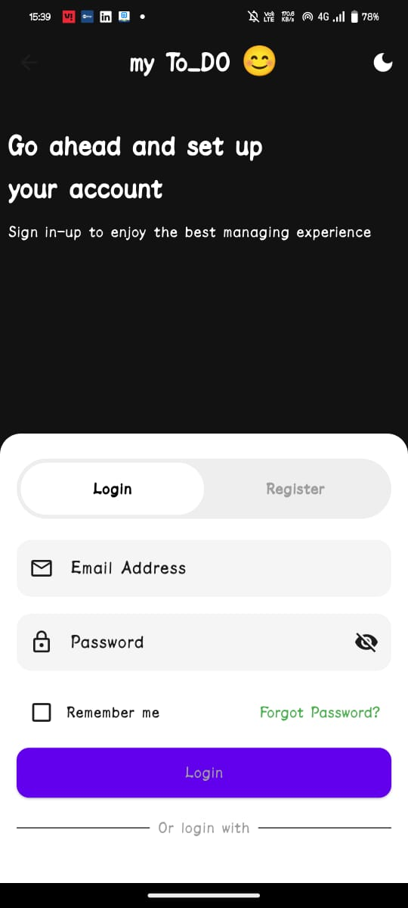
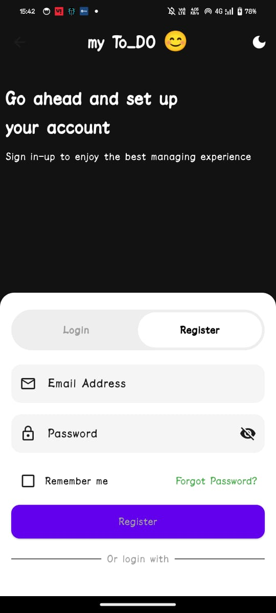
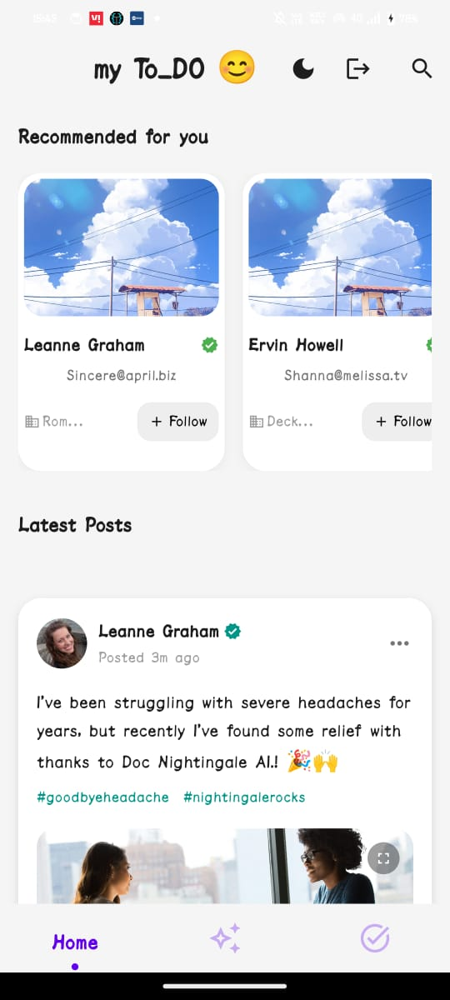
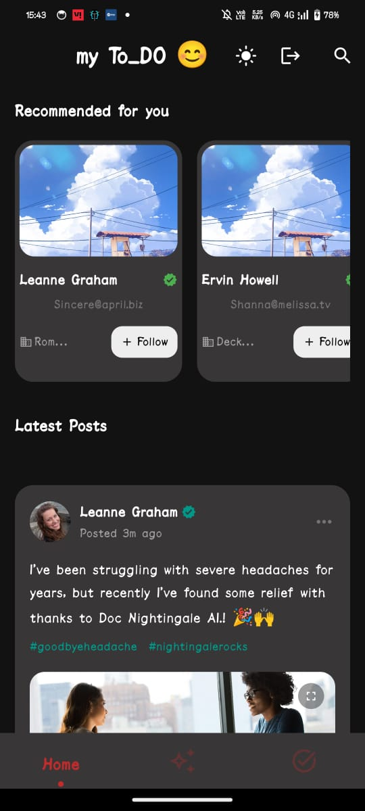
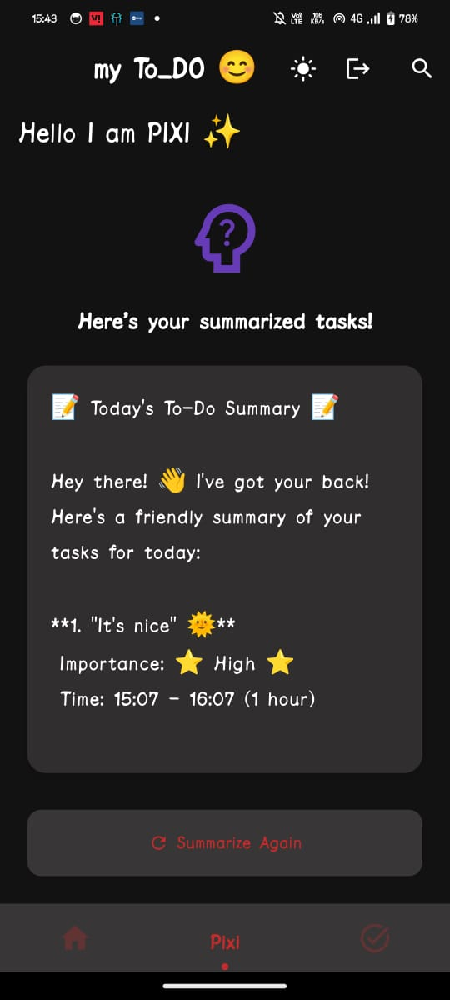
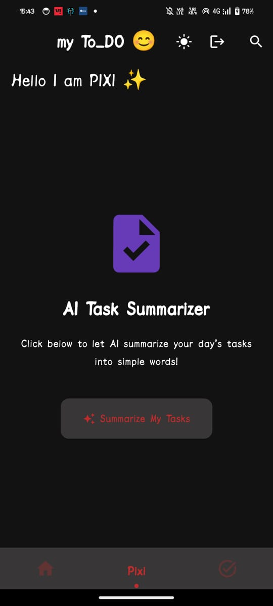
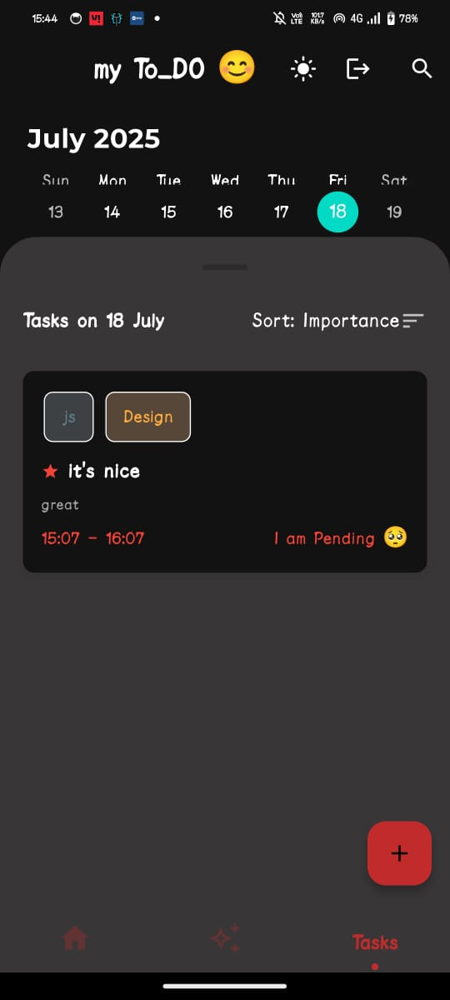
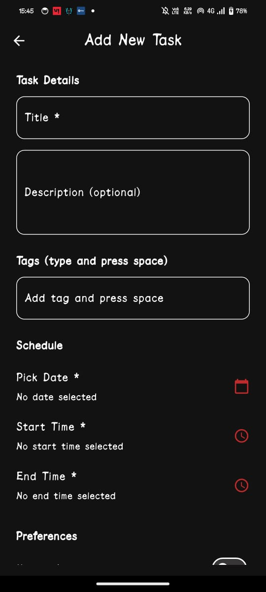
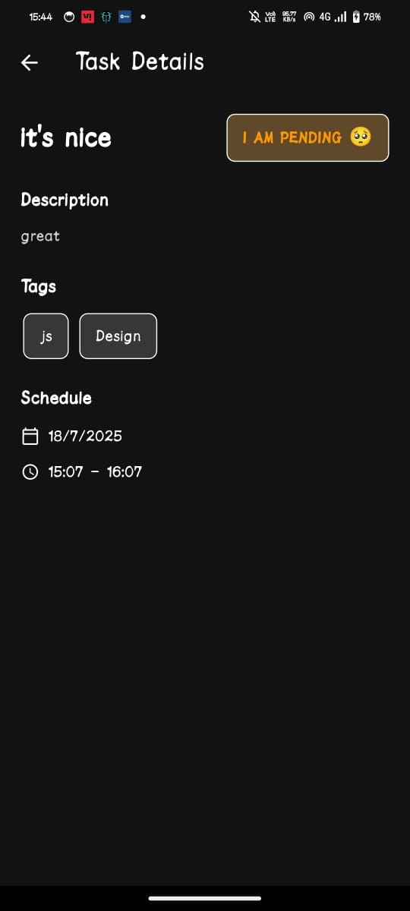

# Flutter Todo App

A modern, feature-rich Todo application built with Flutter, showcasing best practices in mobile app development.


## 📸 Screenshots

### 🔐 Login & Register
<div align="center">
  
  
</div>

---

### 🏠 Home Page (Light & Dark Mode)
<div align="center">
  
  
</div>

---

### 🤖 AI Summarizer Feature
<div align="center">
  
  
</div>

---

### 📋 All Tasks & Add Task
<div align="center">
  
  
</div>

---

### 📄 Task Details & User Profile
<div align="center">
  
  
</div>


# Project Title
📋 About the App

my To_DO 😊 is a beautifully designed To-Do Task Management App built with Flutter and Riverpod for clean state management.
It features a modern, minimal, and delightful UI inspired by neumorphism principles.

This app isn't just about managing tasks — it also demonstrates integration with external APIs like Groq LLM API for potential AI-powered features (e.g., task summaries, smart suggestions).

🚀 Core Features

📅 Manage tasks with importance, deadlines, and tags

🌓 Light/Dark theme toggle

🔍 Smart Search across tasks and users

🧑‍💻 Fetch user profiles from API (JSONPlaceholder)

✅ Dynamic task status updates (Pending, Completed, Missed)

💡 Beautiful Neumorphic UI with custom search bar

🪄 Integrated Groq API (foundation for future AI capabilities)

🔐 Firebase Authentication (Login, Register)

| **Package**                | **Purpose**                        | **Pub.dev** Link                                                                  |
| -------------------------- | ---------------------------------- | --------------------------------------------------------------------------------- |
| flutter\_riverpod          | State Management                   | [flutter\_riverpod 🔗](https://pub.dev/packages/flutter_riverpod)                 |
| flutter\_inner\_shadow     | Inner Shadow Effects (Neumorphism) | [flutter\_inner\_shadow 🔗](https://pub.dev/packages/flutter_inner_shadow)        |
| hive                       | Local NoSQL Database               | [hive 🔗](https://pub.dev/packages/hive)                                          |
| hive\_flutter              | Hive Flutter Integration           | [hive\_flutter 🔗](https://pub.dev/packages/hive_flutter)                         |
| path\_provider             | Device Path Access                 | [path\_provider 🔗](https://pub.dev/packages/path_provider)                       |
| sliding\_clipped\_nav\_bar | Modern Bottom Navigation Bar       | [sliding\_clipped\_nav\_bar 🔗](https://pub.dev/packages/sliding_clipped_nav_bar) |
| google\_fonts              | Google Fonts Integration           | [google\_fonts 🔗](https://pub.dev/packages/google_fonts)                         |
| flutter\_animate           | Animations                         | [flutter\_animate 🔗](https://pub.dev/packages/flutter_animate)                   |
| table\_calendar            | Calendar UI                        | [table\_calendar 🔗](https://pub.dev/packages/table_calendar)                     |
| animated\_text\_kit        | Animated Text Effects              | [animated\_text\_kit 🔗](https://pub.dev/packages/animated_text_kit)              |
| characters                 | String Manipulation Utils          | [characters 🔗](https://pub.dev/packages/characters)                              |
| flutter\_svg               | SVG Image Support                  | [flutter\_svg 🔗](https://pub.dev/packages/flutter_svg)                           |
| firebase\_core             | Firebase Core SDK                  | [firebase\_core 🔗](https://pub.dev/packages/firebase_core)                       |
| firebase\_auth             | Firebase Authentication SDK        | [firebase\_auth 🔗](https://pub.dev/packages/firebase_auth)                       |
| animations                 | Pre-built Animation Widgets        | [animations 🔗](https://pub.dev/packages/animations)                              |
| flutter\_neumorphic\_plus  | Neumorphic UI Components           | [flutter\_neumorphic\_plus 🔗](https://pub.dev/packages/flutter_neumorphic_plus)  |
| build\_runner              | Code Generator                     | [build\_runner 🔗](https://pub.dev/packages/build_runner)                         |
| hive\_generator            | Hive Model Generator               | [hive\_generator 🔗](https://pub.dev/packages/hive_generator)                     |


| **Package**     | **Version**  |
| --------------- | ------------ |
| flutter\_test   | sdk: flutter |
| hive\_generator | ^2.0.1       |
| build\_runner   | ^2.4.7       |

## Screenshots


## Demo

[click to get release](https://github.com/pratiksingh1702/to-do/releases/download/new/app-release.apk)


## 🛠️ Installation Guide

```bash
 lib/
├── src/
│   ├── common/          # Reusable widgets (BottomNav, GroqUI)
│   ├── features/
│   │   ├── auth/        # Login, Signup, Firebase Auth integration
│   │   ├── todo/        # Todo model, provider, screens
│   │   ├── user/        # User model, API provider, UserCard UI
│   │   ├── search/      # Search bar, providers
│   └── main.dart        # App Entry Point
├── pubspec.yaml         # Dependencies
└── assets/              # Images, SVGs, Icons

```

``` 
git clone https://github.com/your-username/your-repo-name.git
cd your-repo-name

```
```
flutter pub get
```
Setup Firebase
Important: You must add your own google-services.json (Android) and GoogleService-Info.plist (iOS).

Go to Firebase Console

Create a project

Enable Authentication (Email/Password)

Download your config files and place them correctly:

swift
Copy
Edit

```
android/app/google-services.json
ios/Runner/GoogleService-Info.plist

```
🔑 Groq API Integration
(Optional for AI task features)
Sign up for Groq API

Store your GROQ_API_KEY safely (Never commit it publicly)

Use it in your service file:

```dart
Copy
Edit
// Example
final apiKey = 'your-secret-api-key';```

💡 Running the App

flutter run
```


## License

[MIT](https://choosealicense.com/licenses/mit/)
MIT License

Copyright (c) [year] [fullname]

Permission is hereby granted, free of charge, to any person obtaining a copy
of this software and associated documentation files (the "Software"), to deal
in the Software without restriction, including without limitation the rights
to use, copy, modify, merge, publish, distribute, sublicense, and/or sell
copies of the Software, and to permit persons to whom the Software is
furnished to do so, subject to the following conditions:

The above copyright notice and this permission notice shall be included in all
copies or substantial portions of the Software.

THE SOFTWARE IS PROVIDED "AS IS", WITHOUT WARRANTY OF ANY KIND, EXPRESS OR
IMPLIED, INCLUDING BUT NOT LIMITED TO THE WARRANTIES OF MERCHANTABILITY,
FITNESS FOR A PARTICULAR PURPOSE AND NONINFRINGEMENT. IN NO EVENT SHALL THE
AUTHORS OR COPYRIGHT HOLDERS BE LIABLE FOR ANY CLAIM, DAMAGES OR OTHER
LIABILITY, WHETHER IN AN ACTION OF CONTRACT, TORT OR OTHERWISE, ARISING FROM,
OUT OF OR IN CONNECTION WITH THE SOFTWARE OR THE USE OR OTHER DEALINGS IN THE
SOFTWARE.
